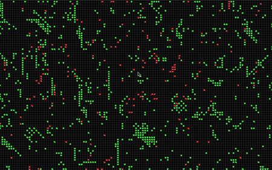
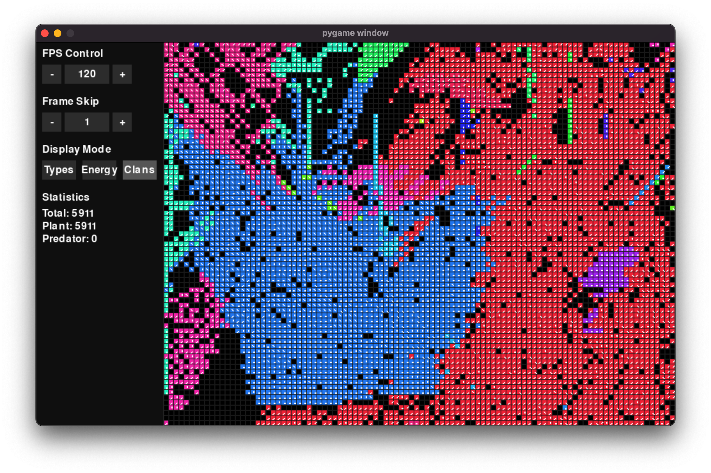

  

#
Этот проект — симуляция жизни клеток, где каждая из них управляется уникальным геномом. Геном определяет действия клетки: движение, размножение, взаимодействие с другими и особенности поведения, например, фотосинтез или атаки. Клетки могут быть родственниками, если их геном совпадает, и передавать свой "клановый" идентификатор потомкам, создавая динамику сотрудничества и конкуренции в рамках групп.  

Симуляция позволяет наблюдать, как случайные мутации и простые правила приводят к сложным эволюционным сценариям. Это эксперимент, который помогает понять, как взаимодействуют конкуренция, кооперация и выживание в ограниченной среде.
#

# Версии:
## v0.1

  

1. **Панель управления**  
   Добавлена панель управления, позволяющая изменять параметры симуляции в реальном времени.

2. **Режимы отображения**  
   Теперь можно переключаться между разными режимами отображения, чтобы фокусироваться на определенных аспектах симуляции.

3. **Баланс между типами существ**  
   Улучшен баланс параметров разных типов существ для более естественного взаимодействия между ними.

4. **Кланы**  
   Добавлена система кланов — групп клеток с одинаковым геномом, что позволяет отслеживать эволюцию генетически схожих групп.